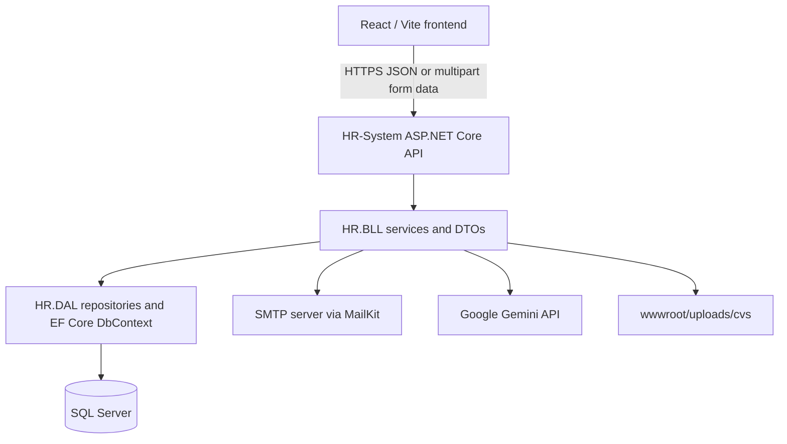
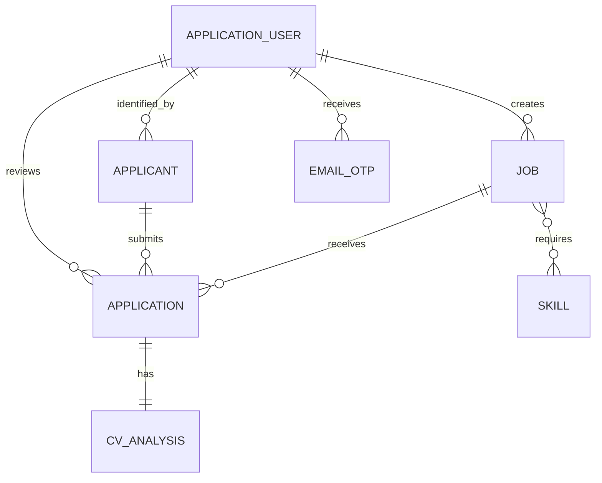

# HR Recruitment System

## 1. Project Overview

The HR Recruitment System is a web application for publishing vacancies, receiving job applications, and supporting HR review with AI-assisted CV matching. It separates the public applicant experience from an internal HR workspace used by administrators and employees.

Its main purpose is to give applicants a structured way to register, verify their email, browse vacancies, and submit a CV, while giving the HR team tools to manage jobs, review applications, view AI match information, update application status, and manage employee accounts.

At a high level, the workflow is:

1. An applicant registers and verifies an email address with an OTP.
2. The applicant logs in, browses jobs, and submits one application per job with a CV and optional cover letter.
3. The API saves the CV, extracts its text, asks Gemini to compare it with the selected job, and associates the returned analysis with the application.
4. An administrator or employee reviews applicants and changes their status. Accepted applications record the reviewer and trigger an acceptance email.
5. Administrators can create and remove employee accounts; newly created employees receive a password-setup link by email.

## 2. Technologies Used

| Area | Technologies found in the repository |
| --- | --- |
| Backend | C#, .NET 8, ASP.NET Core Web API |
| Data access | Entity Framework Core 8, EF Core SQL Server provider, SQL Server / LocalDB configuration |
| Identity and security | ASP.NET Core Identity with `Guid` keys, JWT bearer authentication, role authorization |
| API documentation | Swagger / OpenAPI through Swashbuckle |
| Email | MailKit and MimeKit over SMTP |
| Document processing | UglyToad.PdfPig for PDF text and DocumentFormat.OpenXml for DOCX text |
| AI integration | Google Gemini Generative Language REST API, called through `HttpClient` |
| Frontend | React 19, Vite, React Router DOM, Tailwind CSS, React Icons |

## 3. System Architecture

The backend is organized as three .NET projects. `HR-System` is the API host, `HR.BLL` contains application services and DTOs, and `HR.DAL` contains entities, EF Core configuration, migrations, and repositories. The React frontend is a separate Vite project.



- **Frontend:** Renders public applicant pages and protected HR pages. Its service modules make API requests and its `AuthProvider` maintains the browser session.
- **API layer:** Controllers expose HTTP endpoints, apply route and authorization attributes, read authenticated claims, and delegate work to services.
- **Business logic layer:** Services implement registration, job management, application processing, OTP handling, email delivery, dashboard statistics, and CV analysis. DTOs form the API request/response contracts.
- **Data access layer:** EF Core entity classes represent the database model. Repository classes encapsulate common and entity-specific queries using `ApplicationDbContext`.
- **Database:** SQL Server stores ASP.NET Identity tables plus jobs, applicants, applications, skills, CV analyses, and email OTP records.

A typical request follows this path: a React page calls a module in `Frontend/src/services`; `apiClient.js` builds the HTTP request; an API controller calls an `HR.BLL` service; the service uses repositories or Identity managers; EF Core persists or queries SQL Server; and the controller returns a DTO or status response to the browser.

## 4. Project Structure

```text
HR-System.sln
├── HR-System/                 API host (`HR.API` project)
│   ├── Controllers/           HTTP endpoints
│   ├── wwwroot/uploads/cvs/   Uploaded CV files
│   ├── Program.cs             Dependency injection and middleware
│   └── Seeder.cs              Initial role and admin seeding
├── HR.BLL/                    Business logic layer
│   ├── DTOs/                  Auth, job, application, AI, employee, and dashboard contracts
│   ├── Interfaces/            Service contracts
│   ├── Services/              Core business services
│   └── Services/AiServices/   Prompt, Gemini, and CV-analysis services
├── HR.DAL/                    Data access layer
│   ├── DatabaseContext/       `ApplicationDbContext`
│   ├── Entities/              Domain and Identity entities
│   ├── Repositories/          Generic and specialized EF Core repositories
│   ├── IRepositories/         Repository contracts
│   ├── Configurations/        EF Core configuration classes
│   └── Migrations/            EF Core migrations and model snapshot
└── Frontend/                  React/Vite client
    ├── src/pages/             Applicant, authentication, and HR pages
    ├── src/components/        Reusable auth, applicant, HR, and layout components
    ├── src/services/          API client and endpoint-specific service modules
    ├── src/hooks/             Authentication and fetching hooks
    └── src/routes/            Client-side routes
```

Important backend controllers are `AccountController`, `JobsController`, `ApplicationController`, `ApplicantController`, `EmployeeController`, and `AdminDashboardController`. `DocumentController`, `GeminiTestController`, and `EmailTestController` are also present as utility/test endpoints.

## 5. User Roles

Roles are defined in `HR.BLL/Constants/UserRoles.cs` and seeded in `Seeder.cs`.

| Role | Main responsibilities implemented |
| --- | --- |
| `Applicant` | Register, verify email, log in, view their profile, browse jobs, submit applications, and view their own application summaries. |
| `Employee` | Create, update, and delete jobs; view applications; review application details and AI analysis; update application status; view accepted applications assigned to them; access dashboard statistics. |
| `Admin` | Has the same job/application/dashboard access as an employee and can additionally create, list, view, and delete employee accounts. |

The `HR.DAL.enums.Role` enum contains `HR_Employee`, but the active authorization constants and seeded role name use `Employee`. API authorization follows `UserRoles`, not that enum value.

## 6. Database Design

`ApplicationDbContext` extends `IdentityDbContext<ApplicationUser, ApplicationRole, Guid>`. In addition to the standard ASP.NET Identity tables, the application model contains the entities below.

| Entity/table | Key fields and purpose |
| --- | --- |
| `ApplicationUser` / `AspNetUsers` | Identity user keyed by `Guid`; adds `FirstName`, `LastName`, `ProfileImageUrl`, `CreatedAt`, and nullable `IsEmailVerified`. |
| `ApplicationRole` / `AspNetRoles` | Identity role keyed by `Guid`. |
| `Applicant` / `Applicants` | Integer primary key, `UserId` foreign key to `ApplicationUser`, and an `Applications` navigation collection. |
| `Job` / `Jobs` | Integer primary key; title, description, department, location, employment/workplace/experience enums, minimum experience, dates, active state, creator, skills, and applications. |
| `Skill` / `Skills` | Integer primary key and `Name`; participates in a many-to-many job relationship. |
| `JobSkill` | EF Core-created join table linking `Job.RequiredSkills` and `Skill.Jobs`. |
| `Application` / `Applications` | Integer primary key; `JobId`, `ApplicantId`, CV path, cover letter, submission date, status, optional `ReviewedById`, and `CVAnalysis` navigation. |
| `CVAnalysis` / `CVAnalysis` | Integer primary key, required `ApplicationId`, match percentage, AI summary, matched skills text, and recommendation. |
| `EmailOtp` / `EmailOtps` | `Guid` primary key, user ID, code, expiry, used flag, attempt count, and creation time. |



Relationship details in the current model snapshot:

- `Applicant.UserId` is required and has `DeleteBehavior.NoAction`; the model has an index but does not mark it unique.
- `Application.JobId` and `Application.ApplicantId` are required and both use `DeleteBehavior.NoAction`.
- `Job.CreatedById` is required and uses `DeleteBehavior.NoAction`.
- `Application.ReviewedById` is optional and points to `ApplicationUser`; the migration adds this foreign key without an explicit delete behavior.
- `CVAnalysis.ApplicationId` is required, unique, and forms a one-to-one relationship. Deleting its application cascades to the analysis.
- The generated `JobSkill` join-table foreign keys cascade when their job or skill is deleted.

`ApplicationStatus` values are `Pending`, `Reviewing`, `Accepted`, and `Rejected`. Job enums provide employment type, workplace type, and experience level values; APIs serialize enums as strings through the JSON configuration.

## 7. Authentication and Authorization

The API uses ASP.NET Core Identity for users, password hashing, roles, password-reset tokens, and email confirmation state. JWT bearer authentication is configured in `Program.cs`.

### Applicant registration and verification

`POST /api/Account/register-applicant` creates an `ApplicationUser`, an `Applicant` profile, and assigns the `Applicant` role. It does not return a usable login token at registration; instead it creates a six-digit cryptographically generated OTP, stores an `EmailOtp` record, and sends the code by email.

`POST /api/Account/verify-email` validates the latest unexpired, unused OTP. The code comparison uses `CryptographicOperations.FixedTimeEquals`. An invalid attempt increments `Attempts`; the configured default maximum is five attempts. A successful verification marks both `EmailConfirmed` and `IsEmailVerified`, consumes the OTP, and returns a `LoginResponseDTO` with a JWT.

Applicant login is blocked until both email-verification flags are true. `POST /api/Account/resend-verification` invalidates active OTPs before issuing a replacement. OTP expiry defaults to 10 minutes when no `Otp` configuration section is supplied.

### Login, JWT, and authorization

`POST /api/Account/login` checks Identity credentials and returns `LoginResponseDTO` containing user details, role, token, and expiration. `JwtService` creates a signed HMAC-SHA256 token with these claims:

- `sub`: user ID (`Guid`)
- `jti`: a generated token ID
- `iat`: issued-at Unix timestamp
- `ClaimTypes.NameIdentifier`: user email
- `ClaimTypes.Name`: concatenated first and last name
- `ClaimTypes.Role`: one claim for each assigned role

Controllers protect actions using `[Authorize]` and role lists such as `Admin,Employee` or `Applicant`. The API validates issuer, audience, expiration, and signing key.

The frontend stores `token` and an `authUser` object in `localStorage`. `apiClient.js` adds `Authorization: Bearer <token>` when a service call sets `auth: true`; `ProtectedRoute.jsx` uses the stored role to guard client-side routes. Client-side guards improve navigation, while the API attributes are the enforcement point for protected backend actions.

### Employee password setup

An admin creates an employee without supplying a password. The server assigns the `Employee` role, generates an ASP.NET Identity password-reset token, and emails a frontend link to `/set-password` containing the encoded email and token. `POST /api/Account/set-password` uses `ResetPasswordAsync` to set the new password. The frontend `SetPassword.jsx` reads the query values and posts them to that endpoint.

The current `ForgotPassword.jsx` page is presentational only: it displays a browser alert and does not call a password-reset API.

## 8. Main Features

| Feature | What it does and users | Backend components | Frontend integration |
| --- | --- | --- | --- |
| Job management | Admins and employees create, edit, delete, activate/deactivate, and filter jobs. Skills are supplied as a comma-separated list and reused or created by name. | `JobsController`, `JobService`, `JobRepository`, `SkillRepository`, `JobRequestDTO` | `Dashboard.jsx`, `CreateJob.jsx`, `EditJob.jsx`, `JobFormModal.jsx`, `jobService.js` |
| Public job browsing | Anyone can list jobs with optional filters and open job details. The active-jobs endpoint returns active jobs with a closing date after the current time. | `JobsController`, `JobService`, `JobRepository` | `Home.jsx`, `Jobs.jsx`, `JobDetails.jsx`, `JobSection.jsx`, `jobService.js` |
| Applicant registration/profile | Applicants can register, verify email, log in, and fetch their own basic profile and application history. | `AccountController`, `ApplicantController`, `AuthService`, `ApplicantService` | `Register.jsx`, `VerifyEmail.jsx`, `Login.jsx`, `Profile.jsx`, auth/applicant services |
| Job application and CV upload | An applicant can submit a single application per job with optional cover letter and required CV. The CV is saved under `wwwroot/uploads/cvs`. | `ApplicationController`, `ApplicationService`, `FileService`, `CreateApplicationDTO` | `ApplicationForm.jsx`, `applicationService.js` |
| AI candidate assessment | Each submitted application is passed to CV text extraction and Gemini analysis. Review UIs display match percentage, matched skills, summary, and recommendation. | `CVAnalysisService`, `PromptService`, `AIService`, `DocumentService`, `CVAnalysis` | `Applicants.jsx`, `Candidates.jsx`, `ApplicantDetailsModal.jsx` |
| Application review | Admins/employees list applications, view application detail/CV URL, change status, and export the currently loaded application list as CSV in the browser. Accepted applications retain the reviewer ID. | `ApplicationController`, `ApplicationService`, `ApplicationRepository` | `Applicants.jsx`, `Candidates.jsx`, `MyAcceptedApplications.jsx` |
| Dashboard statistics | Admins/employees can request job totals and period-filtered application/applicant counts. | `AdminDashboardController`, `AdminDashboardService`, `AdminDashboardStatisticsDTO` | `Dashboard.jsx`, `dashboardService.js` |
| Employee management | Admins list employees, create employees with emailed password setup links, and delete employee accounts. | `EmployeeController`, `AccountController`, `EmployeeService`, `AuthService` | `Employees.jsx`, `EmployeeFormModal.jsx`, `employeeService.js` |
| Email notifications | Sends registration OTPs, OTP resends, employee password-setup links, application receipts, and accepted-application notices. | `EmailService`, `AuthService`, `ApplicationService` | Triggered by backend actions; no direct mail client in the UI |

`Analytics.jsx` currently shows hard-coded cards/placeholders, and `Settings.jsx` contains local form controls without a save API. They should not be treated as persisted analytics or configuration features.

## 9. AI CV Analysis

AI analysis runs automatically during `ApplicationService.ApplyAsync` after the uploaded CV is saved. The implemented path is:

```mermaid
flowchart LR
    A[Applicant uploads CV] --> B[FileService saves unique file]
    B --> C[DocumentService extracts text]
    C --> D[JobRepository loads job]
    D --> E[PromptService builds comparison prompt]
    E --> F[AIService calls Gemini]
    F --> G[CVAnalysisDTO deserialized]
    G --> H[CVAnalysis associated with Application]
    H --> I[Application saved]
```



Details of the implementation:

1. `CreateApplicationDTO` accepts multipart form data containing `JobId`, optional `CoverLetter`, and required `CvUrl` (`IFormFile`).
2. `FileService.SaveFileAsync` creates `wwwroot/uploads/cvs` if necessary and stores the upload under a generated GUID filename, retaining the source extension.
3. `DocumentService.ExtractTextAsync` supports `.pdf` through PdfPig and `.docx` through Open XML. Other extensions throw an `Unsupported file type` exception. Although the browser file input also allows `.doc`, the extractor implements PDF and DOCX only.
4. `CVAnalysisService` obtains the job, extracts the stored file’s text, and asks `PromptService.BuildPrompt` to create a prompt containing the job title, job description, required-skill names, and CV text.
5. `AIService` calls the configured Gemini model endpoint and deserializes the returned text as `CVAnalysisDTO`.
6. The prompt requires JSON containing `MatchPercentage` (0–100), `AiEvaluationSummary`, `MatchedSkills`, and `Recommendation` (`Interview` or `Reject`). `CVAnalysisService` joins matched skills into a stored string and assigns the analysis through `Application.CVAnalysis` before the application is added and saved.

Analysis details are exposed to HR-oriented application responses through `ApplicationResponseDTO.CVAnalysis` as `MatchPercentage`, `AiEvaluationSummary`, `MatchedSkills` (split back into a list), and `Recommendation`. Applicant-facing application summaries do not include AI analysis.

No Gemini API key is included in this document. Configure it outside source control as described in [Configuration](#14-configuration).

## 10. API Overview

Routes use the controller names shown below. “Anonymous” means no `[Authorize]` attribute is applied to that action in the current code.

### AccountController — `/api/Account`

| Method | Route | Access | Description / main DTO |
| --- | --- | --- | --- |
| POST | `/create-employee` | Admin | Creates an employee and sends its password-setup email. `CreateEmplyeeRequestDTO` → `CreateEmplyeeResponseDTO`. |
| POST | `/set-password` | Anonymous | Sets a password using an Identity reset token. `SetPasswordDTO` → `SetPasswordResponseDTO`. |
| POST | `/register-applicant` | Anonymous | Registers applicant profile and sends verification OTP. `RegisterApplicantDTO` → `RegisterApplicantResponseDTO`. |
| POST | `/verify-email` | Anonymous | Validates OTP and returns verified login data. `VerifyEmailOtpDTO` → `LoginResponseDTO`. |
| POST | `/resend-verification` | Anonymous | Issues and emails a new applicant verification OTP. `ResendVerificationDTO`. |
| POST | `/login` | Anonymous | Authenticates user and returns `LoginResponseDTO`. `LoginDTO`. |
| GET | `/logout` | Authenticated | Calls Identity sign-out and returns no content. |

### JobsController — `/api/Jobs`

| Method | Route | Access | Description / main DTO |
| --- | --- | --- | --- |
| GET | `/` | Anonymous | Lists jobs; optional query filters: `department`, `location`, `employmentType`, `workplaceType`, `experience`, `isActive`. Returns `JobResponseDTO` collection. |
| GET | `/active` | Anonymous | Lists active jobs whose closing date is in the future. |
| GET | `/{id}` | Anonymous | Gets one job as `JobResponseDTO`. |
| POST | `/` | Admin, Employee | Creates a job. `JobRequestDTO` → `JobResponseDTO`. |
| PUT | `/{id}` | Admin, Employee | Updates a job from `JobRequestDTO`. |
| DELETE | `/{id}` | Admin, Employee | Deletes the job, related applications, and job-skill links. |

### ApplicationController — `/api/Application`

| Method | Route | Access | Description / main DTO |
| --- | --- | --- | --- |
| POST | `/apply` | Applicant | Submits multipart application data and CV. `CreateApplicationDTO` → `ApplicationResponseForApplicantDTO`. |
| GET | `/` | Admin, Employee | Lists applications; optional `jobId`, `applicantId`, and `status` filters. Returns `ApplicationResponseDTO` collection. |
| GET | `/{id}` | Authenticated | Gets a detailed `ApplicationResponseDTO`. |
| GET | `/job/{jobId}` | Admin, Employee | Lists applications for a job. |
| GET | `/me` | Applicant | Lists the caller’s `ApplicationResponseForApplicantDTO` summaries. |
| PUT | `/{id}/status` | Admin, Employee | Updates status from a JSON string such as `"Accepted"`; accepted status records the reviewer. |
| DELETE | `/{id}` | Admin, Employee | Deletes an application. |
| GET | `/my-accepted` | Admin, Employee | Returns accepted applications reviewed by the caller. |

### ApplicantController — `/api/Applicant`

| Method | Route | Access | Description / main DTO |
| --- | --- | --- | --- |
| GET | `/me` | Applicant | Returns caller profile: first name, last name, email, and phone number through `ApplicantProfileResponseDTO`. |

### EmployeeController — `/api/Employee`

| Method | Route | Access | Description / main DTO |
| --- | --- | --- | --- |
| GET | `/` | Admin | Lists employee accounts as `EmployeeDTO` objects. |
| GET | `/{id}` | Admin | Gets one employee account. |
| DELETE | `/{id}` | Admin | Deletes an employee account. |

### AdminDashboardController — `/api/Admin/Dashboard`

| Method | Route | Access | Description / main DTO |
| --- | --- | --- | --- |
| GET | `/statistics?period=Monthly` | Admin, Employee | Returns `AdminDashboardStatisticsDTO`. Supported periods are `Today`, `Weekly`, `Monthly`, `Last 6 Months`, and `Yearly`. |

### Utility/test controllers

| Method | Route | Access in current code | Description |
| --- | --- | --- | --- |
| POST | `/api/Document/extract` | Anonymous | Saves a supplied file and returns extracted text and physical path. |
| POST | `/api/GeminiTest/test?prompt=...` | Anonymous | Sends a supplied prompt directly to the configured Gemini model and returns its raw result. |
| GET | `/api/EmailTest` | Anonymous | Sends an email to configured test recipient/from address. |

The last three endpoints do not currently carry authorization attributes. They are useful for development/testing but should be reviewed before production deployment.

## 11. Frontend Integration

`Frontend/src/services/apiClient.js` is the active HTTP client. It reads `VITE_API_BASE_URL`, falling back to `https://localhost:7256/api`, serializes normal bodies as JSON, keeps `FormData` bodies multipart, parses API errors, and returns JSON/text responses.

The frontend uses these service modules:

- `authService.js`: login, applicant registration, logout, email OTP verification/resend, employee password setup.
- `jobService.js`: job querying/filtering and authenticated create/update/delete calls.
- `applicationService.js`: CV application submission, application retrieval, status update, and accepted-reviewer list.
- `applicantService.js`: authenticated applicant profile request.
- `employeeService.js`: admin employee list/create/delete actions.
- `dashboardService.js`: dashboard statistics request.

`useAuth.jsx` restores `token` and `authUser` from `localStorage`, removes expired stored sessions using the server-provided expiration timestamp, and exposes `login`/`logout` to components. `ProtectedRoute.jsx` redirects unauthenticated visitors to `/login` and checks the stored role before allowing protected routes.

Key frontend routes are:

| Area | Routes and pages |
| --- | --- |
| Public/applicant | `/`, `/home`, `/jobs`, `/jobs/:id`, `/about`; `Home.jsx`, `Jobs.jsx`, `JobDetails.jsx`, `About.jsx` |
| Applicant protected | `/profile`, `/application/:jobId`, `/apply/:id`; `Profile.jsx`, `ApplicationForm.jsx` |
| Authentication | `/login`, `/register`, `/verify-email`, `/set-password`, `/forgot-password`; corresponding `pages/auth` files |
| HR protected | `/dashboard`, `/applicants`, `/my-accepted-applications`, `/analytics`, `/candidates`, `/settings`, `/create-job`, `/dashboard/edit/:id` |
| Admin-only | `/employees` |

The HR `Applicants.jsx` page loads active jobs, loads selected-job applications, displays AI information, updates statuses, and can export loaded rows to a client-generated CSV. `Candidates.jsx` also loads jobs and application detail for candidate review. `Dashboard.jsx` loads job data and dashboard statistics. The applicant profile page combines `/Applicant/me` with `/Application/me`.

## 12. Application Workflow

### Applicant workflow

```text
Register
  → receive OTP email
  → verify email
  → receive JWT/login session
  → browse active jobs
  → submit one application per job (CV + optional cover letter)
  → CV saved and analyzed against job requirements
  → receive application-received email
  → view profile and application status
```

### Admin and employee workflow

```text
Log in
  → access HR dashboard
  → manage jobs (Admin/Employee)
  → load job applications and candidate detail
  → inspect CV link and AI analysis
  → set Reviewing, Accepted, or Rejected status
  → accepted applications store reviewer ID and send applicant email

Admin additionally:
  → create employee account
  → employee receives password-setup email
  → list or delete employee accounts
```

## 13. Email System

`EmailService` uses MailKit’s SMTP client and MimeKit HTML messages. It reads the `EmailSettings` configuration section for host, port, username, password, sender address, and sender display name. It connects using `SecureSocketOptions.SslOnConnect`.

Email is sent in these situations:

- Applicant registration: verification OTP.
- Applicant request to resend verification: replacement OTP.
- Admin-created employee: password-setup link containing an ASP.NET Identity reset token.
- Application submission: confirmation that the application was received.
- Application status changed to `Accepted`: acceptance notice to the applicant.
- `EmailTestController`: a development/test email request.

Use safe configuration values such as `YOUR_EMAIL` and `YOUR_APP_PASSWORD`; do not commit real SMTP credentials.

## 14. Configuration

The API’s `appsettings.json` supplies the connection string, JWT values, frontend password-link location, Gemini provider settings, and SMTP settings. Use user secrets, environment variables, or an ignored local configuration file for real secrets.

```json
{
  "ConnectionStrings": {
    "DefaultConnection": "Server=YOUR_SQL_SERVER;Database=HR_System;Trusted_Connection=True;TrustServerCertificate=True"
  },
  "Jwt": {
    "Issuer": "https://localhost:YOUR_API_PORT",
    "Audience": "http://localhost:YOUR_FRONTEND_PORT",
    "EXPIRATION_MINUTES": 480,
    "Key": "YOUR_LONG_RANDOM_JWT_SIGNING_KEY"
  },
  "Frontend": {
    "BaseUrl": "http://localhost:YOUR_FRONTEND_PORT",
    "EmployeePasswordSetupPath": "/set-password"
  },
  "Gemini": {
    "ApiKey": "YOUR_API_KEY",
    "Model": "YOUR_GEMINI_MODEL"
  },
  "EmailSettings": {
    "Host": "smtp.example.com",
    "Port": "465",
    "Username": "YOUR_EMAIL",
    "Password": "YOUR_APP_PASSWORD",
    "FromEmail": "YOUR_EMAIL",
    "FromName": "HR System"
  },
  "Otp": {
    "ExpirationMinutes": 10,
    "MaxAttempts": 5
  }
}
```

The frontend base URL is configured through `VITE_API_BASE_URL`; for local development it should point to the API’s `/api` root, for example:

```env
VITE_API_BASE_URL=https://localhost:YOUR_API_PORT/api
```

`Program.cs` currently permits CORS only from `http://localhost:5175`. Ensure the frontend’s actual development origin matches that configured origin. The fallback frontend API URL uses port 7256, so local port values must be aligned deliberately.

## 15. Database Migrations

EF Core migrations live in `HR.DAL/Migrations`; the `ApplicationDbContext` itself is in `HR.DAL`, while the startup project is `HR-System` (`HR.API`). From the solution root, typical Package Manager Console commands are:

```powershell
Add-Migration MigrationName -Project HR.DAL -StartupProject HR-System
Update-Database -Project HR.DAL -StartupProject HR-System
```

Equivalent .NET CLI commands are:

```powershell
dotnet ef migrations add MigrationName --project HR.DAL --startup-project HR-System
dotnet ef database update --project HR.DAL --startup-project HR-System
```

Run these after configuring `ConnectionStrings:DefaultConnection`. Existing migrations include the initial model plus later changes for CV-analysis fields, email OTP/email-verification state, and `ReviewedById` on applications.

## 16. Running the Project

1. Clone the repository and open `HR-System.sln`.
2. Configure a SQL Server database connection and secret settings using the safe placeholders in [Configuration](#14-configuration). Do not use committed development secrets for shared or production environments.
3. Restore the .NET dependencies:

   ```powershell
   dotnet restore HR-System.sln
   ```

4. Apply the EF Core migrations:

   ```powershell
   dotnet ef database update --project HR.DAL --startup-project HR-System
   ```

5. Run the ASP.NET Core API:

   ```powershell
   dotnet run --project HR-System
   ```

   In Development, Swagger is enabled at the API’s Swagger route. The seed routine creates the `Admin`, `Employee`, and `Applicant` roles and creates an initial admin only when it does not already exist. Treat seed credentials as development-only and change/remove them before any real deployment.

6. In a second terminal, install frontend dependencies:

   ```powershell
   cd Frontend
   npm install
   ```

7. Set `VITE_API_BASE_URL` if the API is not available at the fallback URL, then start Vite:

   ```powershell
   npm run dev
   ```

8. Confirm the frontend origin is allowed by the API CORS policy before testing authenticated or public requests.

## 17. Security Considerations

Current safeguards include:

- ASP.NET Identity password hashing and password validation settings.
- Signed JWTs with issuer, audience, lifetime, and signing-key validation.
- Role-restricted controller actions for applicant, employee, and administrator functionality.
- Email verification before applicant login, OTP expiry, invalidation of previous active OTPs, fixed-time OTP comparison, and a maximum-attempt mechanism.
- Identity password-reset tokens for employee password setup.
- Protected service calls that send the JWT in an Authorization header.
- Unique generated filenames for uploaded CV files.

Operationally, connection strings, JWT signing keys, SMTP passwords, and Gemini API keys must never be committed to Git. The current codebase contains development configuration values; rotate any exposed credentials and move secrets to a secure secret store before deployment.

The utility/test endpoints documented above are currently anonymous, while file upload handling accepts the uploaded extension before document extraction. Restrict and validate these endpoints and uploads before a production deployment.

## 18. Current Limitations and Future Improvements

The following are observations from the current implementation, not existing features:

- `ForgotPassword.jsx` is a UI-only flow; no corresponding reset-request API exists.
- `Analytics.jsx` displays static values/placeholders, and `Settings.jsx` does not persist form changes.
- `DocumentService` extracts PDF and DOCX text, while the application form also allows choosing `.doc` files; supported UI extensions should be aligned with backend extraction.
- Application status updates record `ReviewedById` only when status becomes `Accepted`; reviewer history for other status changes is not modeled.
- The browser stores JWTs in `localStorage`, which should be evaluated against the deployment’s XSS and session-security requirements.
- The anonymous `Document`, `GeminiTest`, and `EmailTest` endpoints should be restricted, removed, or isolated for production.
- File-size/type validation, centralized exception handling, automated tests, rate limiting, and stronger production secret management would improve operational resilience.

## 19. Conclusion

This project demonstrates a layered .NET 8 recruitment API integrated with a React/Vite client, SQL Server persistence, ASP.NET Identity/JWT authorization, SMTP email workflows, document extraction, and Gemini-assisted CV-to-job evaluation. Its structure makes the applicant journey and internal HR review flow explicit while keeping controllers, business services, and data access responsibilities separate.
